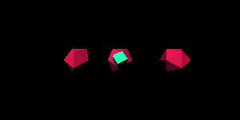

# CubeCrash

> Game in which you control the green cube with A and D keys, avoiding red elements.

## Setup

Install http-server:

``
npm i -g http-server
``

Then run **http-server** command in project directory and open localhost:8080.